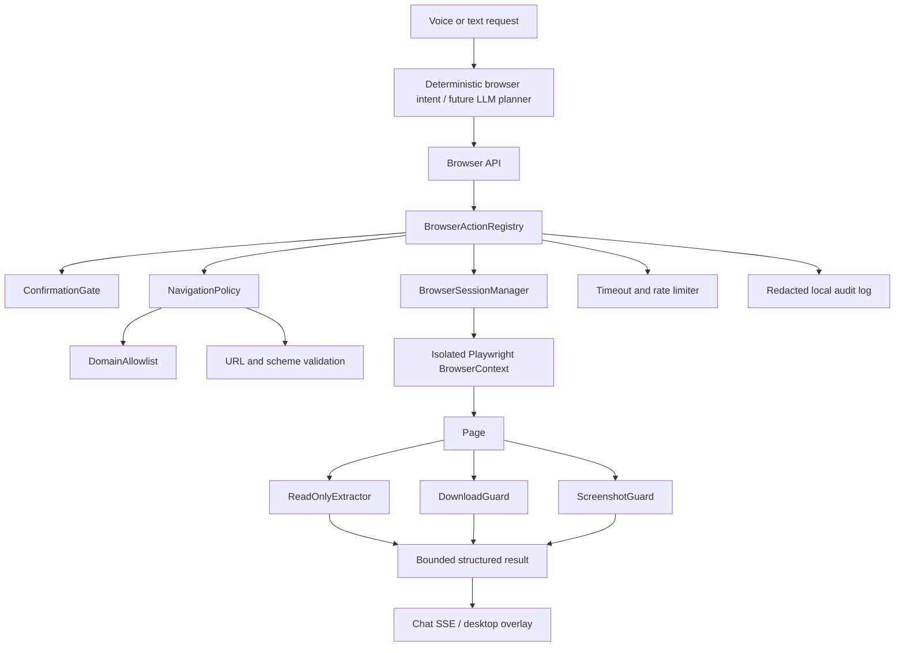

# Elsyia Phase 6 Browser Foundation

**Milestone:** Isolated browser sessions, trusted-domain navigation, read-only page inspection, bounded extraction, and safety enforcement  
**Status:** Architecture defined; implementation follows this contract

## 1. Design goals

The browser foundation extends Elsyia’s existing local tool registry without creating a second automation path. The first milestone is intentionally **read-only by default**: create an isolated browser session, navigate to an approved URL, inspect page metadata, extract bounded readable content, and close the session.

The browser service must be predictable under failure. Every navigation has a timeout, every session has a lifetime, every page result is size-bounded, every domain is checked before navigation, and every operation produces a structured result and a redacted local audit event.

> Browser automation is not allowed to silently submit forms, alter accounts, send messages, make purchases, download arbitrary files, bypass CAPTCHAs, or evade bot-detection systems.

## 2. High-level architecture



The **Browser API** is a thin FastAPI layer. It validates request schemas and delegates to the registry. The **BrowserActionRegistry** is the only component allowed to perform browser actions and applies confirmation, timeout, rate-limit, and audit rules. The **NavigationPolicy** is evaluated before a browser context is created or a URL is requested. The **BrowserSessionManager** owns context creation, reuse, expiry, and cleanup.

## 3. Component responsibilities

| Component | Responsibility | Must not do |
|---|---|---|
| `BrowserSessionManager` | Create isolated contexts, track session IDs, expire idle sessions, close pages | Persist cookies by default or share contexts between users/tasks |
| `NavigationPolicy` | Validate scheme, hostname, ports, redirects, and domain allowlist | Automatically trust arbitrary redirect destinations |
| `BrowserActionRegistry` | Enforce action permissions, confirmation, rate limits, timeouts, and audit events | Execute arbitrary JavaScript supplied by the user or page |
| `ReadOnlyExtractor` | Extract title, URL, visible text, headings, links, and simple tables with limits | Return unbounded HTML, scripts, cookies, or hidden fields |
| `DownloadGuard` | Restrict download domains, directory, file size, and extension policy | Download executables or write outside the safe download root |
| `ScreenshotGuard` | Capture only visible browser content into a controlled local directory | Capture the whole desktop or hidden browser state |
| `BrowserAuditAdapter` | Record action metadata and redacted arguments locally | Store passwords, cookies, full page text, or raw form values |

## 4. Session lifecycle

A session begins only after a valid navigation request. The manager creates a new Playwright browser context with an isolated temporary profile, a controlled viewport, a bounded user agent configuration, and no persistent storage state. A session record contains a random identifier, creation time, last-used time, current URL, approved origin, and state.

The states are `created`, `active`, `idle`, `expired`, `closed`, and `failed`. Idle sessions expire after `BROWSER_SESSION_IDLE_SECONDS`; all sessions are closed during FastAPI shutdown. The API never returns cookies, storage state, authentication headers, or browser internals.

The first milestone does not provide login persistence. If a future feature needs authentication, it must use a user-controlled browser handoff or an explicit encrypted session design reviewed separately.

## 5. Navigation policy

Only `https` and, for explicitly local development targets, `http` are accepted. `file:`, `data:`, `javascript:`, `chrome:`, `edge:`, and extension URLs are rejected. Hostnames are normalized to lowercase and validated against `BROWSER_ALLOWED_DOMAINS`.

Allowlist matching is exact by default. A domain such as `example.com` does not automatically authorize `evil-example.com`; subdomain authorization must be explicit or use a clearly documented suffix rule. IP literals, localhost, private network ranges, unusual ports, and redirects to a new origin are blocked unless separately enabled by configuration.

Every redirect is rechecked. A page that begins on an approved domain but redirects to an unapproved domain is stopped and returned as a policy failure.

## 6. Read-only browser actions

The browser foundation exposes the following initial actions:

| Action | API | Confirmation | Output |
|---|---|---:|---|
| Create session and navigate | `POST /api/v1/browser/navigate` | No for approved URL | Session ID, final URL, title, status |
| Read session state | `GET /api/v1/browser/session/{id}` | No | Current URL, title, timestamps, state |
| Extract page | `POST /api/v1/browser/scrape` | No | Bounded title, headings, visible text, links |
| Close session | `POST /api/v1/browser/session/{id}/close` | No | Closed status |
| Capture viewport | Future foundation extension | No for approved page | Local screenshot token/path |
| Download file | Future foundation extension | Required for external side effect | Guarded local file record |

The first extraction response is bounded by `BROWSER_MAX_TEXT_CHARS`, `BROWSER_MAX_LINKS`, `BROWSER_MAX_HEADINGS`, and `BROWSER_MAX_TABLE_ROWS`. Content is treated as untrusted data. Instructions found in pages are never treated as Elsyia system instructions or permission grants.

## 7. Safety policy

### 7.1 Action classification

| Risk class | Examples | Default behavior |
|---|---|---|
| Read-only | Navigate, title, visible text, headings, links, session status | Allowed on trusted domains |
| Local artifact | Screenshot, bounded download | Confirmation or explicit user request, safe directory and limits |
| External side effect | Click submit, send message, publish, upload, change account data | Always confirmation immediately before execution |
| High impact | Payment, purchase, deletion, password, legal/medical/financial submission | Not automatic in the foundation; require dedicated review and user takeover |
| Disallowed | CAPTCHA bypass, bot-evasion, credential harvesting, arbitrary JavaScript execution | Reject |

### 7.2 Data minimization

The browser service does not return cookies, passwords, authorization headers, hidden form values, page scripts, or full raw HTML. Extracted text is bounded and can be summarized locally through the existing Ollama path. Cloud summarization is opt-in and must be visible in configuration.

### 7.3 Confirmation semantics

Confirmation is attached to the exact action and target. A confirmation for navigating to a page does not authorize clicking a submit button. A confirmation for downloading one file does not authorize future downloads. The API returns `confirmation_required` with a human-readable explanation and a normalized action preview.

### 7.4 Timeouts and resource limits

Each navigation, extraction, screenshot, and download has an independent timeout. Sessions have idle and total lifetimes. Concurrent sessions and actions are capped. Page text, link count, heading count, table rows, screenshot dimensions, download size, and download extension are bounded.

### 7.5 Audit policy

Each action records timestamp, session ID hash, action name, origin hostname, status, and policy decision. URLs may be reduced to origin plus path hash. Query strings, form values, cookies, page text, download contents, and screenshot pixels are not written to the audit log.

## 8. Initial configuration

```env
BROWSER_ENABLED=true
BROWSER_HEADLESS=true
BROWSER_ALLOWED_DOMAINS=
BROWSER_ALLOWED_SCHEMES=https
BROWSER_MAX_SESSIONS=3
BROWSER_SESSION_IDLE_SECONDS=300
BROWSER_SESSION_MAX_SECONDS=1800
BROWSER_NAVIGATION_TIMEOUT_SECONDS=15
BROWSER_ACTION_TIMEOUT_SECONDS=10
BROWSER_MAX_TEXT_CHARS=20000
BROWSER_MAX_LINKS=100
BROWSER_MAX_HEADINGS=50
BROWSER_MAX_TABLE_ROWS=100
BROWSER_DOWNLOADS_ENABLED=false
BROWSER_DOWNLOAD_ROOT=data/browser_downloads
BROWSER_MAX_DOWNLOAD_BYTES=10000000
BROWSER_SCREENSHOTS_ENABLED=false
BROWSER_SCREENSHOT_ROOT=data/browser_screenshots
```

An empty domain allowlist means browser navigation is disabled, not unrestricted. Enabling a domain must be an explicit local configuration change. The foundation starts headless and read-only.

## 9. Threat model and mitigations

| Threat | Mitigation |
|---|---|
| Malicious page instructions | Page content is data only; no privilege escalation from page text |
| Redirect to an untrusted origin | Validate every redirect and final origin |
| SSRF or local-network probing | HTTPS-only default, domain allowlist, IP/private-range rejection |
| Cookie or credential leakage | Fresh non-persistent contexts; never return storage state |
| Unbounded page memory | Text, links, tables, sessions, and concurrency limits |
| Destructive click | Read-only foundation; future clicks require target preview and confirmation |
| Malicious download | Disabled initially; future root, size, type, and domain guards |
| Infinite page/hanging navigation | Per-action timeouts and session cleanup |
| Audit privacy leak | Redacted, origin-focused audit records |

## 10. Milestone acceptance criteria

The browser foundation is ready when it can create an isolated session, navigate only to a configured trusted HTTPS domain, revalidate redirects, return bounded title/text/link data, close or expire sessions, reject untrusted schemes/domains, survive navigation and extraction timeouts, and pass tests proving that no page content can authorize a restricted action.

Form submission, login persistence, password autofill, purchases, arbitrary JavaScript, CAPTCHA handling, bot-detection evasion, and unrestricted downloads are explicitly outside this milestone.
